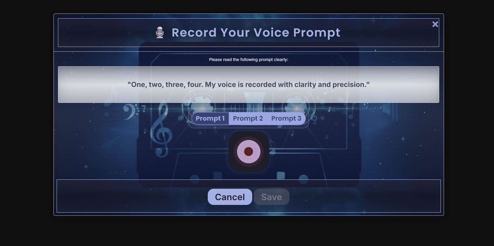
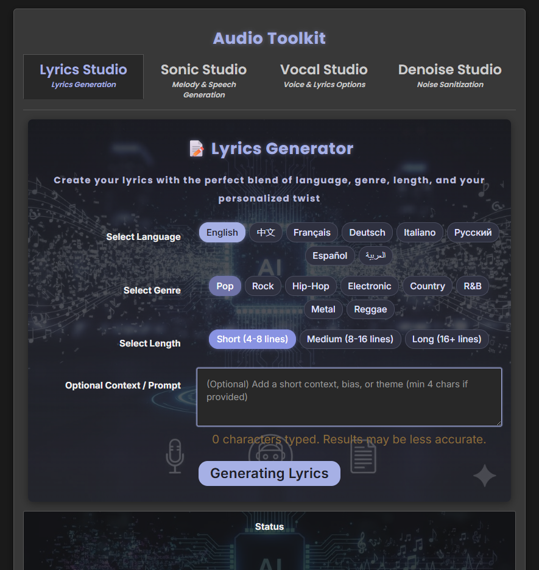

# SonosphereAI 🎶

## Description
**SonosphereAI** is a unified, AI-powered music production suite designed to streamline the entire creative workflow from concept to track. Leveraging state-of-the-art models like Musicgen for instrumentals and Bark AI/Coqui XTTS for voice synthesis, the platform offers two dedicated environments: the Sonic Studio for diverse, multi-lingual AI voices, and the Vocal Studio for personalized voice cloning and pitch refinement. Core features include a Markovify-driven Lyrics Studio, an automated Quality Assurance pipeline with professional Noise Reduction and Auto-Tuning, and flexible output for generating either a complete song or Text-to-Speech narration. It is the end-to-end tool for creators seeking to transform ideas into broadcast-ready, high-fidelity musical pieces.

---

## ✨ Features

# 🎶 AI Music Studio: Production Suite

This application provides a complete, professional workflow for music creation, from generating lyrics and instrumentals to synthesizing vocals and mastering the final track. The entire system is built upon a **unified processing pipeline**, meaning that all core AI models are fully integrated and accessible across the entire platform.

**The core engine is powered by an advanced suite of AI models and tools:**
* **Musicgen:** For generating complex, high-fidelity instrumental tracks.
* **Bark AI & Coqui XTTS:** For highly expressive and multi-lingual Text-to-Speech (TTS) vocal synthesis.
* **Markovify:** For generating coherent, contextually relevant song lyrics.

### ⚙️ Supported Capabilities Overview

The SonosphereAI platform offers extensive support across multiple dimensions for deep customization of your music.

| Category | Supported Items | Notes |
| :--- | :--- | :--- |
| **Instruments** | Full Music, Piano, Guitar, Violin, Drums, Bass, Flute, Bell | Used by Musicgen to tailor instrumental tracks. |
| **Genres** | Pop, Rock, Hip-Hop, Electronic, Country, R&B, Metal, Reggae | Guides the style of both music and lyric generation. |
| **TTS (Coqui XTTS)** | English, Chinese, French, German, Hindi, Italian, Japanese, Korean, Polish, Portuguese, Russian, Spanish, Turkish, Arabic | Provides diverse, high-fidelity, and multi-lingual voice synthesis. |
| **TTS (Bark AI)** | English, Chinese, French, German, Hindi, Italian, Japanese, Korean, Polish, Portuguese, Russian, Spanish, Turkish | Used for voice cloning in the Vocal Studio (13 languages). |
| **Lyrics Studio** | English, Chinese, French, German, Italian, Russian, Spanish, Arabic | Languages supported by the Markovify text generator (8 languages). |
---

## 🎙️ Sonic Studio & Vocal Studio: The Creation Workflow

The two main studios guide the user's input, but both feed into the same backend system for processing and mixing.
This application is built on a single, powerful architecture that merges instrumental creation and vocal synthesis into one seamless process. The two Studio tabs act as input interfaces, but they both utilize the same underlying AI engine, ensuring a consistent workflow and professional-grade output.

The entire system is powered by an integrated suite of advanced AI models:

| AI Model     | Primary Function                                       | Secondary Function (Shared Pipeline)                      |
|--------------|---------------------------------------------------------|------------------------------------------------------------|
| **Musicgen** | Generating complex, high-fidelity Instrumental Tracks. | Integrated into the final mixing process.                 |
| **Bark AI**  | Highly expressive Text-to-Speech (TTS) Synthesis.      | Available for vocal generation in both Sonic & Vocal Studio contexts. |
| **Coqui XTTS** | Multi-lingual, Multi-speaker TTS and Voice Cloning. | Available for vocal generation in both Sonic & Vocal Studio contexts. |

---

### 🎹 Sonic Studio: Ready-Made Voice Generation

The Sonic Studio is focused on efficiency, allowing you to create an entire song using pre-trained, high-quality AI voices.

---

---
* **Voice Source:** You choose from a variety of male and female voices across **14 supported languages** (English, Chinese, French, German, Spanish, etc.).
* **Core AI Technology:** Instrumental generation is primarily driven by **Musicgen**. The vocals are created simultaneously by the integrated **Bark AI** or **Coqui XTTS** model you select.
* **Creative Input:** Guide the generation using a **Text Prompt**, selecting a **Genre** (Pop, Rock, Hip-Hop, etc.), and focusing on specific **Instruments**.
* **Text-to-Speech (TTS) Only Mode:** In addition to full music generation, the studio offers the flexibility to generate just the synthesized vocal track without the instrumental music. This allows you to use the diverse variety of pre-set, multi-lingual voices (powered by Bark AI and Coqui XTTS) for narration, audiobooks, or focusing purely on vocal output.
* **Vocal Refinement (Auto-Tuning):** Using the **`librosa`** library, the system automatically analyzes the fundamental frequency of the vocal track. It then applies an intelligent **pitch shift** correction to stabilize the vocal tuning, guaranteeing the voice is perfectly in key with the instrumental track.
* **Combining and Mixing:** The refined vocal track and the instrumental track are combined using professional audio processing tools (**FFmpeg** is executed via subprocess). This step automatically balances the audio levels: the **vocals are kept prominent** (volume `1.0`) over the **backing instrumental** (volume `0.6`), delivering a balanced, broadcast-quality mix.
* **Final Output:** The finished song is saved in the user's selected file format (WAV, MP3, FLAC, OPUS, and OGG).

---

### 🎤 Vocal Studio: Your Voice, Your Song

The Vocal Studio is dedicated to **Vocal Cloning** and **Pitch Refinement**, allowing you to use your own recorded voice for the track.

---

---
* **Voice Source:** You **record a sample** directly in-app. This recording is then cloned or used as the basis for the final song.

 
* **Core AI Technology:** While it relies on **Musicgen** to create the instrumental track and uses **Bark AI / Coqui XTTS** for internal processing and analysis, the main focus is on high-fidelity **vocal processing** (Noise Reduction, Pitch Correction) applied to your uploaded audio.
* **Process:** Your voice is cleaned and refined before being mixed with the instrumental track.
* **Text-to-Speech (TTS) Only Mode:** The studio allows you to generate just the synthesized vocal track without the instrumental accompaniment. This functionality is essential for reading text using your own cloned/recorded voice, perfect for custom narration, audio letters, or creating unique vocal samples.
* **Vocal Refinement (Auto-Tuning):** Using the **`librosa`** library, the system automatically analyzes the fundamental frequency of the vocal track. It then applies an intelligent **pitch shift** correction to stabilize the vocal tuning, guaranteeing the voice is perfectly in key with the instrumental track.
* **Combining and Mixing:** The refined vocal track and the instrumental track are combined using professional audio processing tools (**FFmpeg** is executed via subprocess). This step automatically balances the audio levels: the **vocals are kept prominent** (volume `1.0`) over the **backing instrumental** (volume `0.6`), delivering a balanced, broadcast-quality mix.
* **Final Output:** The finished song is saved in the user's selected file format (WAV, MP3, FLAC, OPUS, and OGG).


---

### ✍️ Lyrics Studio: AI Lyric Generator

The Lyrics Studio provides a massive creative jumpstart, helping you generate custom, unique lyrics tailored to your specific song parameters.

---

---

* **Core AI Technology: Markovify:** The system is powered by the **`markovify`** library, which builds a complex statistical model of word relationships from a vast database of lyrics. This allows it to construct new verses that are grammatically sound and possess the stylistic coherence of real songs.
* **Lyrics Database & Customization:**
    * The generator draws from a massive, multi-genre, and multi-lingual **lyrics database** (e.g., `lyrics_corpus.db`).
    * You can provide a short **Creative Bias** (a few keywords or lines) to weight the AI's output, ensuring the generated lyrics revolve around your core theme.
* **Quality Control:** All generated lyrics are automatically scanned and cleaned using a profanity detection library before they are displayed, guaranteeing appropriate content.

---


### 🎚️ Automated Audio Cleanup (Noise Reduction)

This section of the Application ensures professional clarity by automatically cleaning your audio, eliminating common recording issues like hiss, static, or environmental background noise.

---

---
* **Process Overview:** As soon as a vocal track is created or uploaded, it is routed through an advanced **denoising** stage. This employs sophisticated algorithms (from libraries like **`noisereduce`** and **`denoiser`**) to analyze the audio spectrum, identify the noise profile, and surgically remove the unwanted frequencies.
* **Final Output:** The finished song is saved in the user's selected file format (WAV, MP3, FLAC, OPUS, and OGG).


**Demonstration of Cleanup Quality**

To showcase the effectiveness of this automated process, here are two samples illustrating the difference between an uncleaned source file and the final output:

* **Original Audio:** Here is a sample of the original uncleaned file that has bunch of clicks and noises.

Noise File:

https://github.com/user-attachments/assets/9a9c4ae4-a68a-438b-ac56-f92b2d3b07c6


* **Cleaned Output:** This is the output after using the app's professional audio cleanup pipeline, where you hear nothing but the pure, clean vocal.
    \[Place Audio Embed of Cleaned File Here]

Denoised File:


https://github.com/user-attachments/assets/04e1b069-462e-48f7-9f7e-817fb0336b9f


---
# 🛠️ Setup, Installation, and Configuration 
---

## Installation


1. **Install Python:** Download and install Python from [python.org](https://www.python.org/downloads/).


2. **(Optional) Anaconda:** We recommend using Anaconda for managing your Python environment. You can download it from [anaconda.com](https://www.anaconda.com/products/distribution).


3. **Clone the repository:**

   ```bash

   git clone [https://github.com/MOGHADBAN/SonosphereAI.git](https://github.com/MOGHADBAN/SonosphereAI.git)```

4.  **Navigate to the backend directory:**


    ```bash

    cd SonosphereAI/backend

    ```

    

5.  **Create a virtual environment:**

    ```bash

    python -m venv venv

    ```

    

6.  **Activate the virtual environment:**

    
    -   **Windows:** `venv\Scripts\activate`

    -   **Bash/macOS:** `source venv/bin/activate`

        

7.  **Install dependencies:**

    ```bash

    pip3 install -r requirements.txt

    ```

    

8.  **Run the application:**

    ```bash

    python3 app.py

    ```
## 📦 Lyrics Database Setup (MANDATORY)
 

The Lyrics Studio requires a large song data corpus to train the **Markovify AI**. Since the database file is too large to include directly in the repository, we use the dedicated `gdown` utility to ensure a reliable download from Google Drive.

---

## ⚙️ Option 1: Automatic Setup Script (Recommended)

This is the fastest and most reliable way to get the database file.

### 1. Prerequisite

Ensure the `gdown` library is installed on your system:

```bash
pip install gdown
```

### 2. Run the Setup Script
Execute the script from your terminal in the directory ```.\SonosphereAI\backend``` 
```bash
python setup_database.py
```

This script handles the Google Drive security checks, downloads the file, and places it in the correct location.

#### 📍 Expected File Location
The database file will be placed here relative to the root directory: ../frontend/static/lyrics_corpora/lyrics_corpus.db

## ⚙️ Option 2: Manual Download (Backup)
Use this option only if the automatic script (Option 1) fails.


**File Name:** `lyrics_corpus.db`

**Download Link:** https://drive.google.com/file/d/1dH4wl9wJul1zph1HD0LHsNlBw66rg9Dz/view?usp=drive_link 

**Required Path:**  
After downloading the file, you must place `lyrics_corpus.db` inside the following directory structure relative to your main application folder:


```bash
../frontend/static/lyrics_corpora/lyrics_corpus.db
```


**Note:**  
If the `lyrics_corpora` folder does not exist within `frontend/static/`, please create it before placing the database file. If the file is not placed at this exact path, the Lyrics Studio will be unable to access the data needed for generation.


## Usage

Once executed, follow prompt for a link provided in the log when you run the ```python3 app.py``` command. Click on that link in a browser to launch the app.


