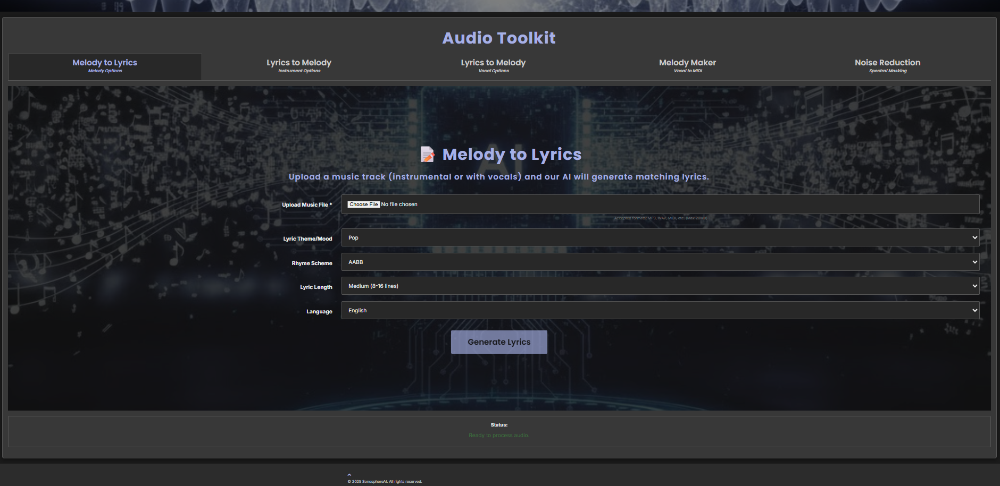
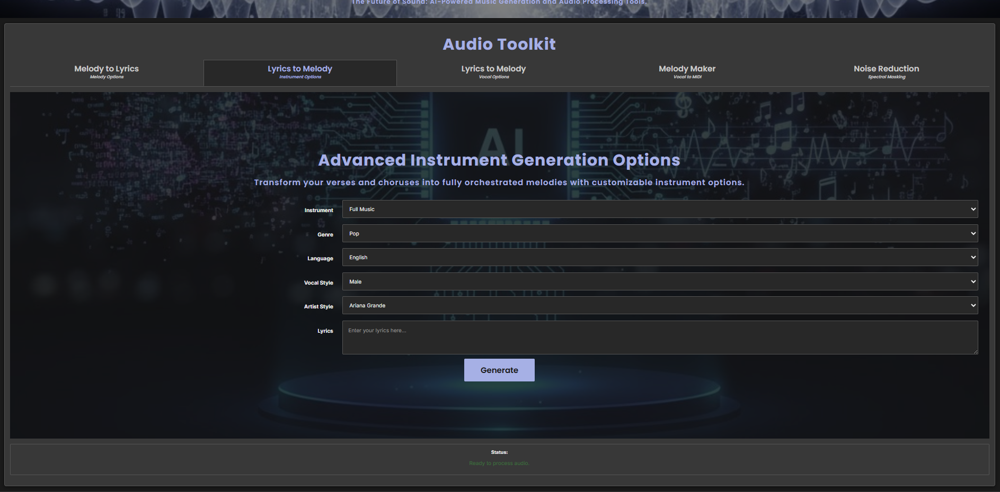
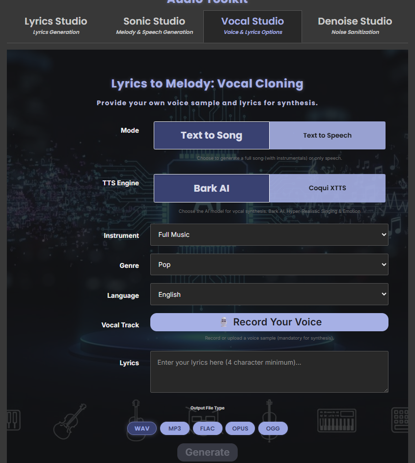
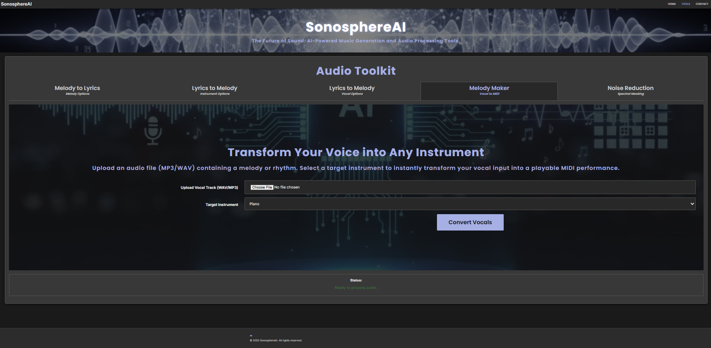
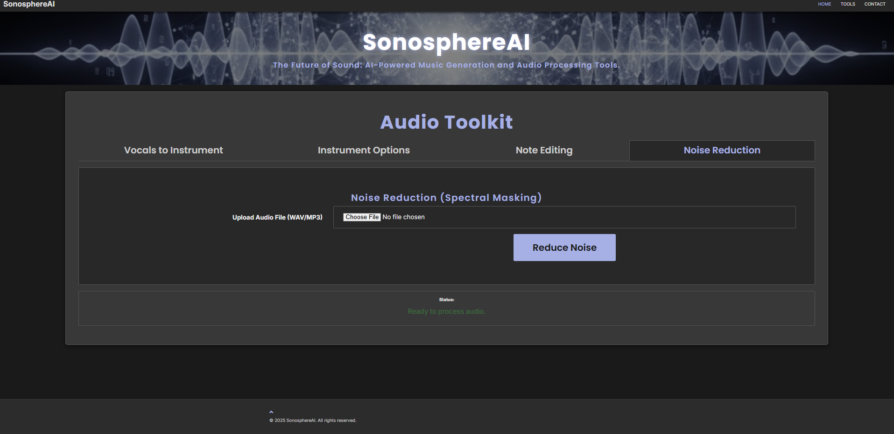

# SonosphereAI 🎶

## Description
**SonosphereAI** is an AI-powered audio generation platform designed to seamlessly blend music and voice synthesis. It enables users to create musical compositions by transforming vocals into instrumentals and vice versa. The platform supports multiple instruments and languages, and includes features like noise reduction and note editing for refined audio output. It's an innovative tool for musicians and poets to transform their creative ideas into complete musical pieces.

---

## ✨ Features

SonosphereAI's Audio Toolkit is a **five-in-one** suite of tools, accessible via a seamless tab interface, to cover all your audio manipulation needs:

---

### 🎶 Melody to Lyrics
**Melody to Lyrics** | *AI-Powered Lyric Generation*

This **new feature** allows you to upload an existing musical track (instrumental or with vocals). Our AI will analyze the melody and harmonic structure to generate original, matching lyrics based on your preferences. You can customize the **Lyric Style/Mood** (e.g., Pop), **Rhyme Scheme** (e.g., AABB), **Lyric Length** (e.g., Medium (5-10 lines)), and **Language** (e.g., English).


---

### 🎤 Lyrics to Melody (Instrumental)
**Lyrics to Melody** | *Instrumental Synthesis*

This tool takes your written lyrics and synthesizes a corresponding melody and instrumental backing track. It essentially reverses the process, allowing your words to inspire the music. This aligns with your original **Vocals to Instrument Conversion** concept.


---

### 🎵 Lyrics to Melody (Vocal)
**Lyrics to Melody** | *Vocal Synthesis*

This section is dedicated to **vocal synthesis**, which takes your lyrics and generates the corresponding vocal track, complete with realistic pitch and performance characteristics. This aligns with your original **Advanced Instrument Options** and **MIDI-like Note Editing** concepts by focusing on fine-grained control over the generated vocal performance.


---

### 🎼 Melody Maker
**Melody Maker** | *Vocals & MIDI*

A comprehensive creative hub for constructing music. This combines the ability to input a melody to generate vocals with **MIDI-like note editing** capabilities for precise control over the musical score, including features like adjusting **Pitch Band** values.


---

### 🔇 Noise Reduction
**Noise Reduction** | *Spectral Masking*

Easily clean up your audio files. This feature uses advanced **spectral masking** to precisely identify and minimize unwanted background noise, resulting in clearer, professional-sounding tracks with a simple upload.

---

## Installation


1. **Install Python:** Download and install Python from [python.org](https://www.python.org/downloads/).


2. **(Optional) Anaconda:** We recommend using Anaconda for managing your Python environment. You can download it from [anaconda.com](https://www.anaconda.com/products/distribution).


3. **Clone the repository:**

   ```bash

   git clone [https://github.com/MOGHADBAN/SonosphereAI.git](https://github.com/MOGHADBAN/SonosphereAI.git)```

4.  **Navigate to the backend directory:**

    

    ```bash

    cd SonosphereAI/backend

    ```

    

5.  **Create a virtual environment:**

    

    ```bash

    python3 -m venv venv

    ```

    

6.  **Activate the virtual environment:**

    

    -   **Windows:** `venv\Scripts\activate`

        

    -   **Bash/macOS:** `source venv/bin/activate`

        

7.  **Install dependencies:**

    ```bash

    pip3 install -r requirements.txt

    ```

    

8.  **Run the application:**

    ```bash

    python3 app.py

    ```

  

    


## Usage

Once executed, follow prompt for a link provided in the log when you run the ```python3 app.py``` command. Click on that link in a browser to launch the app.


## To Do:


This project is incomplete and still a work in progress. Further commits with updates will be pushed. If you have any questions or concerns, please contact the author.

---

## To Do:

This project is incomplete and still a work in progress. Further commits with updates will be pushed. If you have any questions or concerns, please contact the author.
