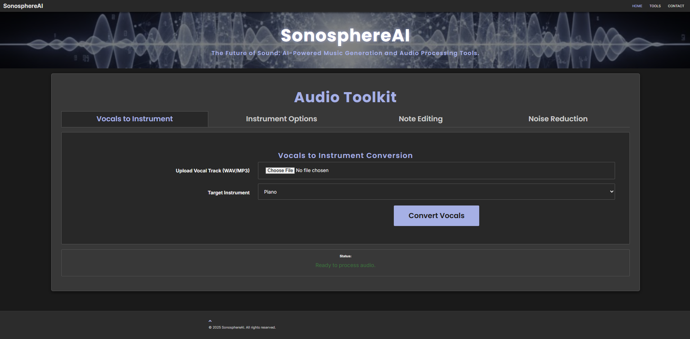
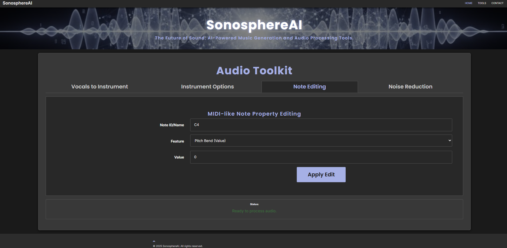

# SonosphereAI 🎶

## Description
**SonosphereAI** is an AI-powered audio generation platform designed to seamlessly blend music and voice synthesis. It enables users to create musical compositions by transforming vocals into instrumentals and vice versa. The platform supports multiple instruments and languages, and includes features like noise reduction and note editing for refined audio output. It's an innovative tool for musicians and poets to transform their creative ideas into complete musical pieces.

---

## Features

SonosphereAI's Audio Toolkit provides four core functionalities:

### 🎤 Vocals to Instrument Conversion
This feature allows you to upload a vocal track and convert its melody into an instrumental performance. You can select the **Target Instrument** (e.g., Piano) for the conversion.



### 🎹 Advanced Instrument Options
This section offers fine-grained control over instrument generation. You can specify the **Instrument**, music **Genre**, **Language**, **Vocal Style** (Male/Female), and even an **Artist Style** (e.g., Ariana Grande) to influence the AI's output.


### 🎼 MIDI-like Note Editing
For precise control, you can edit the properties of specific notes. This includes modifying a **Note ID/Name** (e.g., C4) and adjusting a **Feature** like **Pitch Band (Value)** to refine the audio's performance characteristics.



### 🔇 Noise Reduction (Spectral Masking)
Easily clean up your audio files. The **Noise Reduction** tool uses a spectral masking technique to minimize unwanted background noise, resulting in clearer and professional-sounding tracks.


---

## Installation


1. **Install Python:** Download and install Python from [python.org](https://www.python.org/downloads/).


2. **(Optional) Anaconda:** We recommend using Anaconda for managing your Python environment. You can download it from [anaconda.com](https://www.anaconda.com/products/distribution).


3. **Clone the repository:**

   ```bash

   git clone [https://github.com/MOGHADBAN/SonosphereAI.git](https://github.com/MOGHADBAN/SonosphereAI.git)```

4.  **Navigate to the backend directory:**

    

    ```bash

    cd SonosphereAI/backend

    ```

    

5.  **Create a virtual environment:**

    

    ```bash

    python3 -m venv venv

    ```

    

6.  **Activate the virtual environment:**

    

    -   **Windows:** `venv\Scripts\activate`

        

    -   **Bash/macOS:** `source venv/bin/activate`

        

7.  **Install dependencies:**

    ```bash

    pip3 install -r requirements.txt

    ```

    

8.  **Run the application:**

    ```bash

    python3 app.py

    ```

  

    


## Usage

Once executed, follow prompt for a link provided in the log when you run the ```python3 app.py``` command. Click on that link in a browser to launch the app.


## To Do:


This project is incomplete and still a work in progress. Further commits with updates will be pushed. If you have any questions or concerns, please contact the author.

---

## To Do:

This project is incomplete and still a work in progress. Further commits with updates will be pushed. If you have any questions or concerns, please contact the author.
